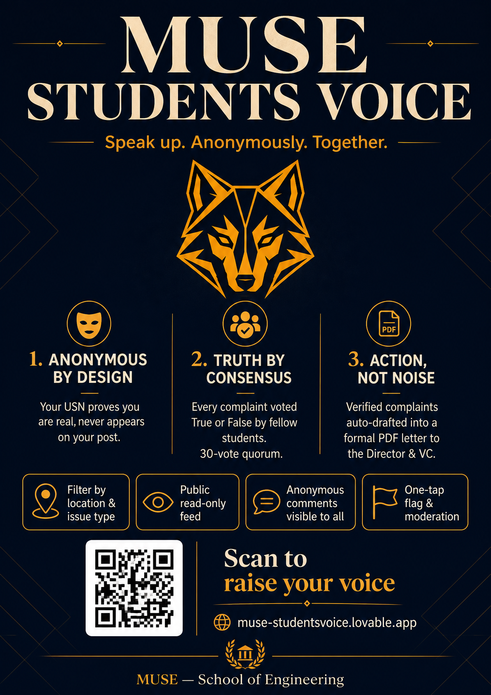

<div align="center">

# 🗣️ MUSE Students Voice

**Speak up. Anonymously. Together.**

A student-run grievance platform where the campus itself decides what's real —
every complaint is voted True or False by fellow students, and the ones that
cross the quorum get auto-drafted into a formal PDF letter to the Director
and Vice Chancellor.

[](https://muse-studentsvoice.lovable.app)
[](https://github.com/Abhirai2006/muse-students-voice/actions/workflows/ci.yml)
[](mailto:studentsvoice.muse@gmail.com)

<p>
  
  
  
  
  
  
</p>

</div>

---

<div align="center">
  
</div>

---

## ✨ Why this exists

Every campus has the same story: broken labs, unsafe walkways, unheard voices.
Complaint boxes get ignored. Group chats go nowhere. Names attached to
complaints invite retaliation.

**MUSE Students Voice fixes that with three ideas:**

1. **Anonymity by design** — Your USN is used **only** to prove you're a real
   student and prevent duplicates. It never appears on your post, vote, or
   comment. Not even the admin sees who wrote what.
2. **Truth by consensus** — Every complaint is voted **True** or **False**.
   Only complaints that clear a quorum move forward. Fake outrage dies quietly.
3. **Action, not noise** — Verified complaints are compiled into a formal PDF
   letter addressed to the Director and Vice Chancellor, ready to send.

---

## 🚀 Features

### 🎓 For Students
- 🔐 **USN-gated signup** — one account per USN, validated against a seeded
  registry of **~1,159 real USNs** across AIML, AIDS, CS&D, BMRE and CIVIL
  (batches 2022 – 2025).
- 🕶️ **Anonymous posting** — pick a location (labs, blocks, admin) and an
  issue type (infrastructure, safety, faculty conduct, academics…).
- ✅ **True / False voting** — 30-vote quorum with a live percentage bar.
- 💬 **Anonymous comments** — everyone gets a per-post pseudo-handle
  (`Owl-42`, `Falcon-07`…) so threads read like a conversation, not a mob.
- 🚩 **One-tap flag** for spam, personal attacks, or false claims — flagged
  posts land in the admin queue automatically.
- 📰 **Public read-only feed** — parents, alumni, and the press can browse
  without signing up. Includes **category filters** (location + issue type),
  keyword search, and sort by Newest / Most Voted / Trending (24 h).
- 👀 **Public comments** — visitors without an account can read every
  comment thread through the sanitized `public_comments` view; only posting
  requires a USN-linked account.
- 🌗 **Midnight Letterhead** dark mode — a warm, paper-like palette designed
  for long reads.

### 🛡️ For Admins
- 📥 **Moderation queue** — every flagged post surfaces here with reporter
  counts and reasons; one click to remove or dismiss.
- 🚨 **Threshold alerts** — the panel highlights complaints that just crossed
  the quorum and are ready to escalate.
- 📄 **One-click PDF letter** — auto-generates a formal, signed complaint
  letter (jsPDF) addressed to the Director and VC, along with a matching
  **copy-paste email body** — so you can send it in under a minute.
- 👥 **Role-based access** via `user_roles` + `has_role()` RPC — no admin
  flags on the profile, no privilege escalation.

### 🧠 Under the hood
- **Server-side rendered** on Cloudflare Workers via TanStack Start.
- **Row Level Security** on every public table. Public reads happen through
  sanitized views (`public_posts`, `public_comments`) that strip author IDs.
- **Security-definer RPCs** (`check_usn_available`, `record_visit`,
  `get_visit_counts`) so the app never touches sensitive tables directly.
- **JSON-LD structured data** (`Organization`, `WebSite`,
  `DiscussionForumPosting`, `FAQPage`) — Google understands every complaint
  as a first-class forum post.
- **Live visitor badge** with online / total counters powered by
  90-second heartbeats.
- **Full SEO surface** — sitemap.xml, robots.txt, llms.txt, per-post OG /
  Twitter cards, canonical URLs.

---

## 🧭 The Complaint Lifecycle

```
   ┌───────────┐    ┌─────────────┐    ┌──────────────┐    ┌────────────┐
   │  Student  │ →  │  Anonymous  │ →  │   Campus     │ →  │   Admin    │
   │  signs in │    │   post +    │    │   votes      │    │   letter   │
   │  with USN │    │  location   │    │  True/False  │    │  + email   │
   └───────────┘    └─────────────┘    └──────┬───────┘    └─────┬──────┘
                                              │                  │
                                    30 votes, majority True      ▼
                                              │           Director / VC
                                              ▼
                                    ✅ Verified & escalated
```

---

## 🏗️ Tech Stack

| | |
|--|--|
| **Framework** | TanStack Start v1 — React 19, SSR-aware, file-based routing |
| **Build** | Vite 7 |
| **Language** | TypeScript 5 (strict) |
| **Styling** | Tailwind CSS v4 (`@import "tailwindcss"`, OKLCH tokens, no config file) |
| **UI kit** | shadcn/ui + lucide-react |
| **Backend** | Supabase — Postgres, Auth (email + Google OAuth), Storage, RLS |
| **Server logic** | `createServerFn` (TanStack) + Postgres `SECURITY DEFINER` RPCs |
| **PDF** | jsPDF (client-side letter generation) |
| **Deployment** | Cloudflare Workers (edge SSR) |
| **Fonts** | Playfair Display · Inter |

All business logic lives in **pure TypeScript** under `src/lib/` — no server
state leaks into components; every route is a thin adapter over typed server
functions.

---

## 📁 Project Structure

```
src/
├── routes/                    # File-based routes (TanStack Router)
│   ├── __root.tsx             # Global shell, head metadata, JSON-LD
│   ├── index.tsx              # Public landing + read-only feed
│   ├── auth.tsx               # Signup / signin / forgot password
│   ├── reset-password.tsx     # Post-email password reset flow
│   ├── feed.tsx               # Authenticated feed (H1, filters)
│   ├── post.$id.tsx           # Single complaint (dynamic OG + JSON-LD)
│   ├── my-complaints.tsx      # A student's own posts + status
│   ├── admin.tsx              # Moderation queue + escalation letters
│   ├── verified.tsx           # Public wall of escalated complaints
│   ├── about.tsx              # Mission + FAQPage JSON-LD
│   ├── complaint-guide.tsx    # How-to write an effective complaint
│   ├── privacy.tsx  terms.tsx
│   └── sitemap[.]xml.ts       # SSR sitemap generator
│
├── components/
│   ├── SiteShell.tsx          # Nav + footer + theme toggle
│   ├── PostCard.tsx           # Vote bar, flag button, comment count
│   ├── SplashScreen.tsx       # Full-screen intro
│   ├── VisitorBadge.tsx       # Live online/total via RPC
│   └── ui/                    # shadcn/ui primitives
│
├── lib/
│   ├── posts.functions.ts     # Server fns: list/create/vote/flag
│   ├── escalations.functions.ts
│   ├── letterPdf.ts           # jsPDF letter builder
│   ├── auth.ts theme.ts utils.ts
│   └── *.server.ts            # Server-only helpers (never client-imported)
│
└── integrations/supabase/     # Auto-generated clients (do not edit)

supabase/migrations/           # SQL migrations (RLS, RPCs, views, seeds)
public/                        # robots.txt, llms.txt, favicons, og-image
```

---

## 🧪 Local Development

```bash
bun install
bun run dev        # http://localhost:8080
bun run build      # production build (edge target)
bun run lint
```

Requires **Node 20+**. `bun` recommended for install speed.

### Environment

Cloud credentials are injected in production. For local dev, copy `.env.example`
to `.env` and fill in only publishable client values:

```env
VITE_SUPABASE_URL=https://<project>.supabase.co
VITE_SUPABASE_PUBLISHABLE_KEY=<publishable_anon_key>
VITE_SUPABASE_PROJECT_ID=<project_id>
```

These are **publishable** client keys, but `.env` should stay local so private
values never get committed by accident. **Never** commit service-role keys,
SMTP credentials, database passwords, or personal tokens.

---

## 🗄️ Database

Managed on Supabase. All public-facing reads go through sanitized views so
author IDs never leave the server.

| Table | Purpose |
|-------|---------|
| `allowed_usns`   | Seeded USN registry — private, read only via `check_usn_available` RPC |
| `profiles`       | One row per user, linked to a claimed USN |
| `posts`          | Complaints (location + issue_type + body) |
| `votes`          | One True/False vote per user per post |
| `comments`       | Anonymous comments with per-post pseudo-handles |
| `flags`          | Reports on posts / comments — feeds the admin queue |
| `escalations`    | Verified complaints exported to PDF letter |
| `user_roles`     | Role assignments, checked via `has_role()` RPC |
| `site_visits`    | Anonymous visitor heartbeats (write via RPC only) |

**Views:** `public_posts`, `public_comments` — strip author IDs.
**RPCs:** `check_usn_available`, `record_visit`, `get_visit_counts`,
`has_role`.

RLS is enabled on every public table. No table grants `SELECT` to `anon`
directly — everything goes through views or `SECURITY DEFINER` functions.

---

## 🛡️ Security Model

- 🔒 **No admin flag on profiles** — roles live in a separate `user_roles`
  table, checked via a `SECURITY DEFINER` function to prevent privilege
  escalation.
- 🕵️ **USN registry is private** — the signup form calls a narrow RPC that
  answers only `available` / `claimed` / `invalid`.
- 👥 **Author IDs never leak** — public reads use sanitized views.
- ✋ **No unauthenticated writes** — every INSERT/UPDATE policy scopes to
  `auth.uid()`.
- 🔁 **Reset-password fallback** — the reset page shows the admin email so
  students who don't receive the mail can still reach a human.

---

## 👑 Admin Access

Admin is granted by a row in `user_roles` (`role = 'admin'`) scoped to a
specific USN. Current admin: **`24SEAI003`**.

```sql
insert into public.user_roles (user_id, role)
values ('<auth.uid of the new admin>', 'admin');
```

---

## 📈 Scaling Notes

- ✅ Comfortably serves **2,000+ concurrent students** — the app is edge-SSR
  on Cloudflare Workers, and every database query is either cached at the
  view layer or gated by an index (`posts.created_at`, `votes.post_id`,
  `flags.target_id`).
- 🧊 Cold reads are single-digit ms because sanitized views are cheap.
- 🔔 Visitor heartbeats are debounced to **once every 90 s** per session, so
  presence tracking stays flat regardless of tab activity.

---

## 🗺️ Roadmap

- [ ] Weekly digest email of top-voted complaints
- [ ] Multi-institute mode (drop-in for other engineering colleges)
- [ ] Comment reactions + threading
- [ ] Signed PDF export with QR verification link
- [ ] Public "resolved" wall — closed loops shown alongside verified ones

---

## 🤝 Contributing

PRs welcome. See [CONTRIBUTING.md](CONTRIBUTING.md) for the full checklist.
The rules of the road:

1. Keep it **anonymous by default** — nothing that reveals a user's identity
   in feeds, comments, or exports.
2. Every new table needs **RLS + GRANTs + policies** in the same migration.
3. Public reads go through **views**, not base tables.
4. UI changes stay in frontend code — no business logic in components.

---

## 📬 Contact

**studentsvoice.muse@gmail.com**

For students who didn't receive the password reset email, for admins of other
campuses interested in adopting this, or for anyone with a fix to suggest.

---

## 📜 License

This project is licensed under the [PolyForm Noncommercial License 1.0.0](LICENSE).
The code is shared for transparency and academic reference; commercial use is
not permitted without separate permission.

<div align="center">

**Built with ❤️ by MUSE students, for MUSE students.**

</div>
